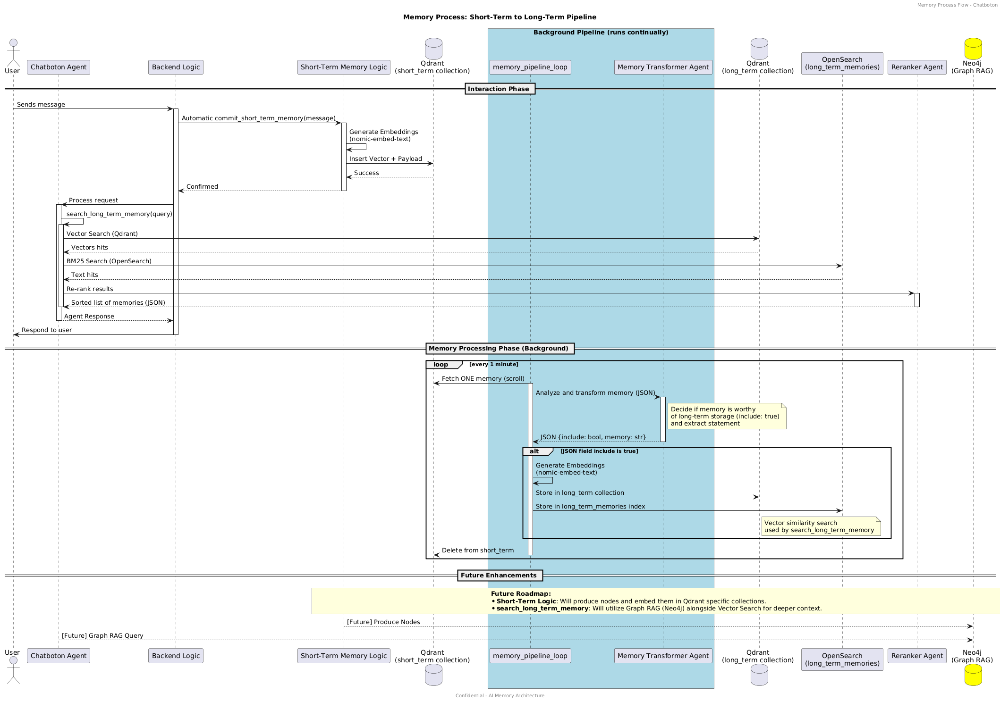

# Chatboton

A deliberately simple playground for humans testing **AI tool development**:
a LangChain tool-calling agent on a local Ollama model (a Heretic-abliterated
Qwen by default), one docker-compose with five databases (Postgres, Neo4j,
Chroma, Qdrant, OpenSearch), one sample tool per database, and a tiny web UI
with a chat view and a tool-invocation log.

All five databases hold the same demo "gadget store" data, so cross-database
questions work: product names match across the SQL table, the purchase graph,
the review vectors, the Qdrant vector store, and the OpenSearch index.

## Layout

```
chatboton/            core package
  providers.py        swappable LLM providers: ollama | openai | anthropic | azure_openai
  agent.py            LangChain create_agent + system prompt
  tool_log.py         in-memory tool-invocation log
  tools/              one small class per database → one LangChain tool each
    postgres_tool.py    query_postgres(sql)         products table
    neo4j_tool.py       query_neo4j(cypher)         (:Customer)-[:BOUGHT]->(:Product)
    chroma_tool.py      search_reviews(query)       review vectors (Ollama embeddings)
    qdrant_tool.py      search_products_v2(query)   vector search in Qdrant
    opensearch_tool.py  full_text_search(query)     keyword search in OpenSearch
app/                  FastAPI + Jinja2 UI (chat + tool log tabs, reset button)
docker/postgres-init/ SQL seed, runs on first `docker compose up`
ollama/Modelfile      heretic base model + tool-aware qwen2.5 chat template
scripts/seed.py       seeds Neo4j, Chroma, Qdrant, OpenSearch
tests/                unit tests (mocked) + integration tests (skip without docker)
```

## Setup

For detailed, step-by-step setup instructions for your platform, see:
- [Linux (Ubuntu-like) Setup Guide](docs/SETUP_LINUX.md)
- [macOS Setup Guide](docs/SETUP_MACOS.md)

## Quickstart (Short Version)

```bash
# 1. Databases
docker compose up -d

# 2. Models (agent + embeddings)
ollama pull R4C3R/qwen2.5-3b-heretic
ollama create chatboton-heretic -f ollama/Modelfile   # adds a tool-aware chat template
ollama pull nomic-embed-text

# 3. Python env
python3 -m venv .venv && source .venv/bin/activate
pip install -r requirements.txt

# 4. Seed Neo4j, Chroma, Qdrant, OpenSearch (Postgres seeds itself on first boot)
python scripts/seed.py

# 5. Run
python -m uvicorn app.main:app --port 8011
```

Open http://localhost:8011 — the **Chat** and **Tool Log** tabs switch without
reloading, so the conversation survives navigation; the red **Reset
conversation** button is the only thing that clears it.

Things to ask the agent:

- "Which products cost less than 50 euro?" (Postgres)
- "Who bought the powerbank, and what else did they buy?" (Neo4j)
- "What do reviewers say about battery life?" (Chroma)
- "Find the best-reviewed keyboard and tell me its price and stock." (multiple tools)
- "Show me products related to audio." (Qdrant)
- "Search for products with 'wireless' in the name." (OpenSearch)

## Memory

Chatboton features a multi-stage memory system to retain context across interactions.

### Memory Architecture



- **Short-Term Memory**: Every user message is automatically committed to a `short_term` Qdrant collection by the application backend.
- **Background Pipeline**: A process runs every minute to evaluate short-term memories.
- **Memory Transformer**: A dedicated agent analyzes short-term memories using a deterministic JSON-based evaluation (`include: boolean`, `memory: string`) to decide if information is worthy of long-term storage.
- **Long-Term Storage**: Memories confirmed as valuable are transformed and moved to the `long_term` collection in Qdrant and indexed in OpenSearch.
- **Long-Term Search**: The `search_long_term_memory` tool implements a **Hybrid Search** flow:
    1. **Vector Search**: Similarity search in Qdrant.
    2. **BM25 Search**: Text search in OpenSearch.
    3. **Reranking**: A Reranker Agent evaluates combined results to return the most relevant context as a JSON list.

## Swapping providers

Set `CHATBOTON_PROVIDER` in `.env` (copy `.env.example`) to `ollama`,
`openai`, `anthropic`, or `azure_openai` and provide that provider's API key
variables. Every provider is a small class in `chatboton/providers.py`
returning a LangChain chat model, so the agent code never changes.

## Tests

```bash
python -m pytest              # unit tests: providers, tools, app — no docker needed
docker compose up -d && python scripts/seed.py
python -m pytest tests/test_integration.py   # real-database checks (auto-skip when down)
```

## Ports

| Service | Port |
|---|---|
| App | 8011 |
| Postgres | 55433 |
| Neo4j browser / bolt | 57475 / 57688 |
| Chroma | 58001 |
| Qdrant | 58333 |
| OpenSearch | 59200 |
| Ollama (external) | 11434 |
